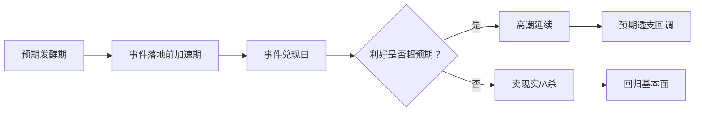

```yaml
---
type: 概念
title: "事件驱动交易"
created: 2026-06-02
updated: 2026-06-02
tags:
  - 事件驱动
  - 交易方法
  - 情绪映射
  - 窗口期
related:
  - 概念/强预期弱现实
  - 概念/题材无实质映射
  - 概念/交易模式的生存条件
  - 策略/退潮票早盘清仓
sources:
  - "6月投资日历-2026-05-31.md"
confidence_grade: B
confidence_reason: 基于6月投资日历的实战总结，事件驱动方法论有明确的窗口期和映射规则
---

# 事件驱动交易

## 定义

事件驱动交易是一种基于已知未来事件（IPO、大会、政策、赛事等）进行提前埋伏或即时反应的中短期交易方法。其核心假设是：特定事件会在时间窗口内引发股性激活、情绪共振或资金流入。

## 核心分类

### 1. 基本面驱动事件
事件对A股标的的业绩或订单有直接、可量化的影响。
- **案例**：N1X芯片发布对PCB供应商的订单预期（如 [[鹏鼎控股]]）。但需警惕“方向已退”——若行业下行，事件可能无法扭转趋势。
- **特点**：可估值、有产业链支撑。

### 2. 情绪映射事件
事件在海外或非A股市场发生，A股只能通过资金记忆和概念关联进行炒作，缺乏基本面支撑。
- **典型案例**：[[SpaceX IPO]] 人类最大IPO在美股上市。A股商业航天概念（如金螳螂）纯属情绪映射，不可按基本面定价。这是 [[概念/题材无实质映射]] 的典型场景。
- **特点**：爆发力强、持续性差、兑现后A杀风险高。

### 3. 主题配置事件
事件持续时间长（如气候现象），引发市场对某一板块的系统性重估。
- **案例**：[[厄尔尼诺]] 三重影响（农产品涨价、用电量增加、制冷需求），更接近主题配置而非快进快出的纯事件驱动。
- **特点**：窗口期长、可反复操作，但催化剂不集中。

## 事件驱动交易的生命周期



## 事件窗口与买点规则

| 事件类型 | 最佳窗口 | 买点规则 | 卖点规则 |
|----------|----------|----------|----------|
| 大会/发布会 | 会前1-2天埋伏 | 回调至均线买入 | 兑现日当天或会后1天必卖 |
| IPO/上市 | 审批节点前 | 新闻驱动，即时反应 | 上市日即卖点 |
| 赛事/数据 | 开始前1周 | 分批建仓，避免满仓 | 赛事开幕后逐步退出 |
| 持续主题(厄尔尼诺) | 确认初期 | 启动时试仓，趋势确认加仓 | 主题降温或龙头滞涨 |

## 生存条件（与通用交易模式的关联）

事件驱动交易的生存条件需符合 [[概念/交易模式的生存条件]] 的框架，并补充：
- **日历准确性**：事件必须是市场广泛知晓且日期确定的，未被提前透支。
- **流动性门槛**：事件期市场整体流动性充足，避免在冰点/退潮期进行事件驱动。
- **映射清晰度**：A股受益标的必须明确（至少有一个公认龙头），否则易沦为纯粹的情绪博弈。

## 纪律铁律

1. ✅ **事件驱动 ≠ 必须交易**。若现有持仓尚未清理（参见[[策略/退潮票早盘清仓]]），禁止新增事件交易。
2. ✅ **情绪映射事件必须提前设定兑现纪律**。不得因“故事未完”而改变卖出计划。
3. ✅ **“卖现实”比“买预期”更重要**。事件驱动中最大的亏损多来自兑现后继续持有。
```
