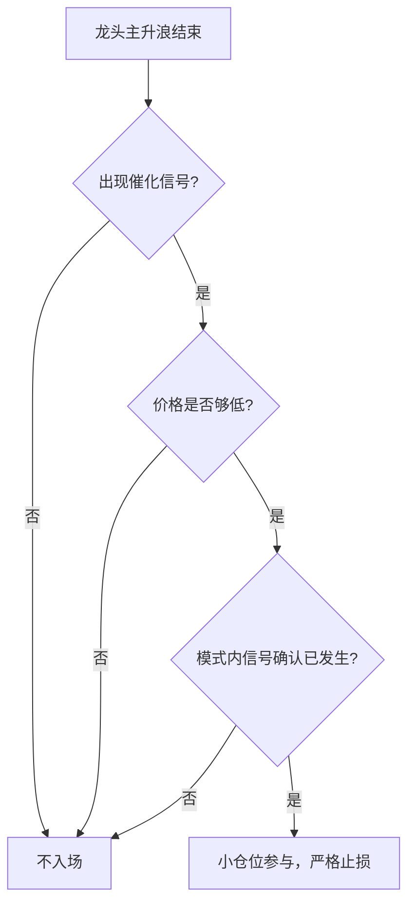

```yaml
type: 概念
title: 博弈二波与双头
created: 2026-05-28
updated: 2026-05-28
tags:
  - 反弹博弈
  - 龙头股高位
  - 二波
  - 双顶
  - 出监管窗口
related:
  - "模式/绕异动临界点参与规则"
  - "概念/龙头切换识别"
  - "分析/ai算力基础设施链主线确立"
sources:
  - "好的，以下是摄入本文档后的关键发现和wiki更新方案。.md"
confidence_grade: B
confidence_reason: 源于5/28复盘中的"明日计划"部分，用户自主定义参与规则及边界条件，逻辑清晰，但缺乏多案例实证
---
```

# 博弈二波与双头

## 定义

在主升浪结束后，参与龙头股因**消息催化**（如出监管窗口）或**技术性反弹**而形成的第二波上涨或双顶结构。

## 核心原则（源于5/28复盘）

### 1. 价格必须够低 — 安全垫原则

- 买入价必须在**技术面/估值层面具有显著的安全边际**
- 极限情形假设：即使反弹失败，亏损也应在接受范围内
- 绝对禁止高位追涨博弈二波

### 2. 模式内信号确认 — 不提前赌

- 必须等待**实际触发信号**落地（如监管窗口正式开放），而非基于预期提前潜伏
- 信号确认后才进入参与决策流程
- 该原则是 [[模式/绕异动临界点参与规则]] 的重要实践延伸

### 3. 伴生轮动定位 — 不占据主线注意力

- 在当前主线（如AI算力基础设施链）明确时，博弈二波属于**伴生板块的轮动观察机会**
- 仓位分配和精力分配上，主线优先，二波博弈不应占据主要资源

## 参与框架



## 与相关模式的区别

| 维度           | 绕异动临界点（常规）       | 博弈二波与双头（高位）     |
|----------------|----------------------------|----------------------------|
| 所处阶段       | 主升浪中段                 | 主升浪结束后               |
| 核心逻辑       | 偏离值套利                 | 反弹/双顶博弈              |
| 安全垫要求     | 中等                       | **极高**                   |
| 信号确认       | 偏离值触发即交易           | **必须等催化落地**         |
| 仓位规划       | 正常仓位                   | **轻仓小赌**               |

→ 完整规则参见：[[模式/绕异动临界点参与规则]]

## 应用场景示例

- 龙头股因短期涨幅过大进入监管周期，市场预期出监管窗口后有二波
- 需确认“**真的出监管了**”才动手，而非在监管期间提前潜伏

## 风险警告

- 二波失败变“A杀”是常见结局
- 若安全垫不足，轻仓也可能变成重亏
- 二波博弈对时机和买入价要求极高，执行困难

