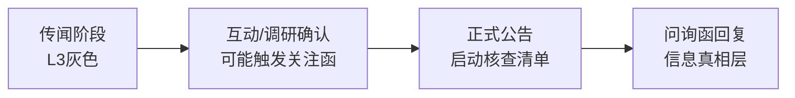

```yaml
---
type: 策略
title: 认证公告合规审查框架
created: 2026-05-29
updated: 2026-05-29
tags:
  - 认证公告
  - 合规审查
  - 容百科技
  - 误导性陈述
  - 信息披露
  - 事件驱动
  - 核查清单
related:
  - "[[概念/外部信号处理框架]]"
  - "[[概念/信号源可信度层级]]"
  - "[[概念/情绪溢价风险]]"
  - "[[股票/高澜股份-300499]]"
sources:
  - "research--2026-05-29-42.md"
confidence_grade: B
confidence_reason: "基于容百科技官方处罚决定书和自愿性信息披露监管规则构建，核心四警示为监管实践的直接迁移，核查清单为规则推演产物"
---
```

# 认证公告合规审查框架

## 定义

针对上市公司发布「获得巨头认证」、「签署战略合作协议」、「中标重大项目」等自愿性信息披露公告时，交易者应启动的**标准化审查流程**。该框架基于**容百科技误导性陈述行政处罚案**（2026年初）的判例逻辑，将监管处罚要点转化为可操作的交易纪律。

> **核心法律认定**：即使公司主观上没有故意欺骗，但只要公告内容与合同/协议实际条款存在实质性差异，且公司未能审慎核实，就构成误导性陈述。后续补充公告**无法完全"净化"初始公告的误导性影响**。

## 适用场景

- 获得大客户技术认证（如高澜GB300液冷认证）
- 签署重大战略合作协议（但无具体金额）
- 中标框架性采购项目（金额为"预估"、"预计"）
- 任何包含"预计"、"有望"、"将"等模糊措辞且引发股价异动的自愿性公告

## 核心工具：容百科技案四大警示

容百科技案是监管实践中非常难得的**精确反向标尺**，四大警示可直接迁移至任何认证/重大合同公告：

| 警示维度 | 容百案例的具体表现 | 通用迁移模板 |
|----------|-------------------|-------------|
| **金额转译** | 将非约束预测（1200亿）转译为公告确定性数字 | 公告将"预计配套量"、"行业市场规模"转译为"为公司带来XX亿收入" |
| **下限省略** | 未披露"需方采购不低于预测值70%" | 公告未提及采购量下限、排他性条款、竞争性议价等约束条件 |
| **前置条件遗漏** | 遗漏"综合竞争力要求"作为履约前置条件 | 量产前的"客户验证"、"产线验收"、"价格竞争力"等条件被省略 |
| **期限错误** | 将协议期限从2030年延伸至2031年 | 认证有效期、续期条件、技术迭代等时间因素被简化 |

## 即时核查清单（7+1项）

当认证/重大合同公告发布时，**立即**逐项核查：

| 核查项 | 具体问题 | 🔴 红色信号（触发则极度谨慎） |
|---|---|---|
| **金额/规模** | 公告是否给出销售额/利润预测？ | "预计为公司带来XX亿收入" |
| **采购约束** | 认证是否附带确定采购承诺？ | 未提及采购量下限或"正在谈判" |
| **前置条件** | 量产前需满足哪些条件？ | "待客户验证"、"待产线验收"出现在末尾 |
| **时间框架** | 认证有效期、量产时间是否明确？ | "预计"、"有望"、"将"等模糊措辞 |
| **竞争格局** | 是否为独家认证？ | 回避是否还有其他供应商 |
| **风险提示** | 公告末尾的风险提示是否充分？ | 仅例行公事："存在不确定性" |
| **历史连贯性** | 此前是否已持续披露该认证进展？ | 之前从未提过，突然公告获得 |
| **高开幅度** | 公告后次日开盘涨幅 | **高开超过5%——市场可能过度解读** |

**使用规则**：出现**任一**红色信号，则强制进入"等待补充公告"模式，禁止在首次公告后追涨。

## 操作流程：信息传递四阶段窗口



| 阶段 | 信号特征 | 操作纪律 |
|------|----------|----------|
| **传闻** | 股吧/社交媒体，L3灰色流传 | **不交易**，仅归档 |
| **互动/调研** | 互动易回复/调研纪要 | **观望**，关注是否触发关注函 |
| **正式公告** | 法定信息披露渠道发布 | **不追涨**，启动即时核查清单 |
| **问询函回复** | 补充/澄清公告（通常1-3交易日） | **窗口全开后评估**，对比首次公告差异 |

## 补充公告的"不可净化"原则

**核心认知**（来自容百案判例）：

> 即使后续补充/澄清公告揭示了更多细节，最初公告本身的误导性已经造成股价异动，补充公告无法完全"净化"最初的影响。

**操作推论**：
- 部分投资者只在首次公告时买入，不追踪补充公告 → 信息不对称中受损
- **交易者应等待问询函回复后再评估**，而非在首次公告时追涨
- 首次公告与问询函回复的**差异程度**，是判断公告质量的核心指标

## 与外部信号处理框架的关系

本框架是[[概念/外部信号处理框架]]在处理「认证类公告」这一特定外部信号时的**专项子模块**。其关系如下：

- [[概念/外部信号处理框架]] 提供总体方法论（信号→框架→决策三步法）
- 本框架提供针对认证公告的具体核查工具（四大警示+7+1核查清单+四阶段窗口）
- 本框架是[[概念/信号源可信度层级]]在时间序列上的展开——从L3（传闻）→L2（互动/调研）→L1（正式公告）的逐步升级

## 适用边界

- **适用范围**：自愿性信息披露中带有"向好消息"性质的公告
- **不适用**：强制披露的定期报告、明确金额的重大合同、已获得交易所事前审核的公告
- **核心前提**：信息来源存在信息不对称——公告发出者（公司）比接受者（投资者）掌握更多细节

## 相关页面

- [[概念/外部信号处理框架]] — 总体方法论
- [[概念/信号源可信度层级]] — L1/L2/L3三级甄别
- [[概念/情绪溢价风险]] — 认证公告后的追涨本质是情绪溢价风险
- [[概念/预期先行业绩滞后]] — 认证≠订单≠业绩，三重滞后
- [[股票/高澜股份-300499]] — 首个应用标的
