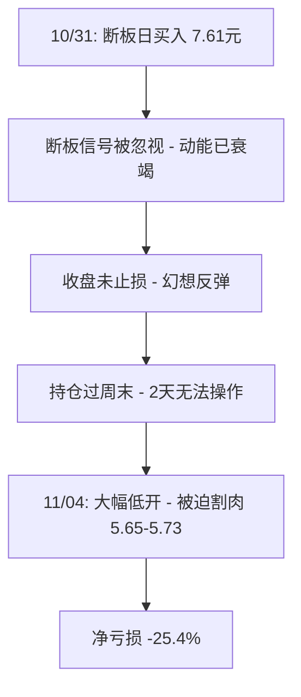

# 思美传媒断板日买入 — 25.4%亏损案例

## 错误概要

| 项目 | 详情 |
|------|------|
| 日期 | 2024-10-31 买入 → 2024-11-04 卖出 |
| 股票 | 思美传媒（002712） |
| 操作 | 断板日（10/31）买入7.61元 → 持仓过周末 → 次周一（11/04）5.65-5.73割肉 |
| 亏损 | **-25.4%（约-7,082元）** |
| 错误类型 | 断板日买入 + 亏损持仓过周末 + 止损延迟 |
| 严重程度 | 🔴🔴🔴 重大（单票亏损占月累计亏损50%+） |

## 失败链条拆解

## 根因分析

| 层级 | 根因 | 解释 |
|------|------|------|
| **买入层** | 违反断板日禁止买入原则 | 连板中断 = 多空力量转换信号，非低吸机会 |
| **止损层** | 10/31盘中未止损 | 断板日收盘前是最佳退出窗口 |
| **持仓层** | 亏损仓位过周末 | 2天缺口叠加断板，低开概率极高 |
| **心理层** | 等反弹幻觉 | "已经跌了这么多，总会反弹一点再走" |

## 如果重来一次

| 时间点 | 正确操作 | 结果 |
|--------|----------|------|
| 10/31 买入前 | **不买断板票** | 避免全部亏损 |
| 10/31 尾盘 | **止损清仓**（即使已亏3-5%） | 亏损控制在-5%以内 |
| 11/01 周五 | **止损清仓**（即使已亏更多） | 避免周末26%缺口 |

## 关联错误

- 此案例可与 [[错误/锚定回追]] 对比：断板买入和锚定回追都是"在错误的位置追入"
- 此案例中的"不割→过周末→更大亏损"链条是 [[概念/恐惧驱动的纪律执行]] 的反面：恐惧本应驱动止损，但未发生
