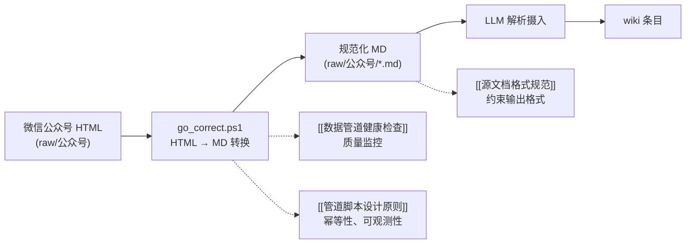

```yaml
---
type: source
title: go_correct — HTML转Markdown批量转换脚本（修正版）
created: 2026-06-11
updated: 2026-06-11
tags: ["数据摄入管道", "脚本", "工具", "PowerShell"]
related: ["批量HTML转Markdown脚本", "go", "数据摄入管道", "数据管道健康检查", "管道脚本设计原则", "源文档格式规范"]
sources: ["go_correct.txt"]
confidence_grade: B
confidence_reason: 脚本源码直接提供，已与已有管道设计原则对照分析
---
```

# go_correct — HTML 转 Markdown 批量转换脚本（修正版）

> 数据摄入管道上游工具，实现微信公众号文章 HTML 到规范化 Markdown 的批量转换。

## 脚本说明

该 PowerShell 脚本是交易知识库**数据摄入管道**的第一步，负责将 `raw/` 目录下的公众号导出的 HTML 文件自动转换为同目录下的 `.md` 文件。

与之前收录的 [[go]]（脚本源代码）相比，本文件 `go_correct.txt` 可能包含修正或优化，代表管道工具的最新版本。

## 核心特性

- **幂等设计**：检查目标 MD 文件是否已存在，避免重复转换覆盖已有内容。
- **增量处理**：仅处理尚无对应 MD 文件的 HTML，支持随时补充新资料。
- **容错机制**：每个文件独立 try-catch，单个文件失败不中断整体流程。
- **进度报告**：每转换 50 个文件输出一次进度。
- **智能正文提取**：优先匹配 `js_content`（微信官方结构），其次 `rich_media_content`，再次 `<body>`，最后兜底全 HTML。
- **标题提取**：依次尝试 `<title>`、`<h1>` 标签，最后使用文件名。
- **基础格式转换**：处理标题、粗体、斜体、列表、引用块、链接、图片，解码 HTML 实体。
- **噪音清理**：移除 `<script>`、`<style>` 标签，合并多余空行。

## 关键代码逻辑

```powershell
# 幂等跳过
if (Test-Path $mdPath) { $skipped++; continue }

# 正文提取优先级
if ($html -match '<div[^>]*id="js_content"[^>]*>([\s\S]*?)</div>') { ... }
elseif ($html -match '<div[^>]*class="rich_media_content[^"]*"[^>]*>...') { ... }
elseif ($html -match '<body[^>]*>([\s\S]*?)</body>') { ... }

# 标题提取
$title = ... # 依次匹配 title, h1, 文件名
```

## 与管道体系的关系



- 上游：`raw/` 目录下的微信公众号 HTML 文件。
- 下游：生成的 `.md` 文件将作为 LLM 解析的源文档，最终进入 wiki。
- 质量保障：生成格式须符合 [[源文档格式规范]]；转换质量需纳入 [[数据管道健康检查]] 监控。

## 已知局限

- 使用正则表达式解析 HTML，对深层嵌套或非标准结构可能转换不完整。
- 无错误日志输出，仅控制台报错，不利于事后审计。
- 未校验输出文件是否为空或过短（可能生成无效 MD）。
- 依赖硬编码的源根目录路径 `"C:\wiki\73神话\raw"`，缺少路径存在性检查。

## 相关页面

- [[批量HTML转Markdown脚本]] — 同一工具的早期文档描述
- [[go]] — 此脚本的早期版本或备份
- [[数据摄入管道]] — 完整的管道流程和完整性监控
- [[数据管道健康检查]] — 管道运行质量检查清单
- [[管道脚本设计原则]] — 设计管道工具应遵循的准则
- [[源文档格式规范]] — 对生成 MD 的结构要求

## 使用建议

1. 定期运行此脚本（如新增公众号文章后），将新 HTML 转换为 MD。
2. 在 [[数据管道健康检查]] 中增加“转换后 MD 为空”的检测项。
3. 考虑输出错误日志文件（`.errors.log`），记录失败文件名，方便回溯。
4. 评估是否改用真正的 HTML 解析库（如 HtmlAgilityPack），提高转换鲁棒性。

